# GNUstep Formatter Fix Orchestration Plan

## Executive Summary
Following comprehensive audit of 30+ formatters, we have identified 6 failing formatters requiring immediate attention. Work can be parallelized across 4 independent tracks with 2 critical issues requiring priority attention.

## Critical Path Items (Block Release)

### Track 1: Unicode String Support (CRITICAL)
**Assignee**: String Specialist Agent
**File**: `/home/robk/code/llvm-project/lldb/source/Plugins/LanguageRuntime/ObjC/GNUstepObjCRuntime/formatters/GNUstepStringFormatters.cpp`
**Lines**: Focus on lines 400-600 (GSCInlineString handling)

**Issue**: Unicode strings show only first character
- Current: Shows "H" for "Hello 世界 🌍"
- Expected: Full Unicode string display
- Test case: Line 46 in test_comprehensive_formatters.m

**Root Cause Analysis**:
- UTF-8 multi-byte sequences incorrectly handled
- Likely stopping at first non-ASCII byte
- Check `ExtractStringContent()` method around line 500

**Fix Strategy**:
1. Review UTF-8 decoding in GSCInlineString path
2. Ensure proper multi-byte character handling
3. Test with 2-byte (Chinese), 3-byte (emoji) characters
4. Verify against `po` command which works correctly

**Validation**:
```lldb
v unicodeString  # Should show "Hello 世界 🌍"
```

### Track 2: Mutable String Support (HIGH)
**Assignee**: String Specialist Agent (same as Track 1 for efficiency)
**File**: Same as Track 1
**Lines**: Focus on GSMutableString class handling

**Issue**: NSMutableString shows empty
- Current: Shows ""
- Expected: "Mutable String"
- Test case: Lines 39-41 in test_comprehensive_formatters.m

**Root Cause Analysis**:
- GSMutableString class not properly detected
- Content extraction failing for mutable variant
- Check class name matching logic

**Fix Strategy**:
1. Add explicit GSMutableString class detection
2. Verify offset calculations for mutable string structure
3. Ensure content pointer dereferencing is correct
4. May need different offset for `_zone` field in mutable variant

**Validation**:
```lldb
v mutableString  # Should show "Mutable String"
```

## High Priority Items (Improve UX)

### Track 3: Dictionary Child Naming
**Assignee**: Collection Specialist Agent
**File**: `/home/robk/code/llvm-project/lldb/source/Plugins/LanguageRuntime/ObjC/GNUstepObjCRuntime/formatters/GNUstepDictionaryFormatters.cpp`
**Lines**: 1546-1561 (GetChildAtIndex method)

**Issue**: Dictionary keys show as [0], [1] instead of actual keys
- Current: Children named [0], [1], [2]
- Expected: Children named by their keys (e.g., "name", "age", "active")
- Test case: Lines 79-83 in test_comprehensive_formatters.m

**Root Cause Analysis**:
- Line 1546: GetElementSummary returns "<invalid>"
- Line 1560: Falls back to index-based naming
- Key extraction from non-tagged strings failing

**Fix Strategy**:
1. Debug why GetElementSummary fails for regular string keys
2. Improve FormatterContext usage in GetElementSummary
3. Add fallback to read NSConstantString keys directly
4. Ensure GSCInlineString keys are properly extracted
5. Keep `key = value` display format as user prefers (unless the only way to get it working is to revert to the old `[0].key` and `[0].value` format)

**Validation**:
```lldb
v simpleDict     # Should show @{"name": "John Doe", "age": 30, "active": YES}
v simpleDict[0]  # Should be accessible by index but show key name
```

### Track 4: NSIndexPath Display
**Assignee**: Foundation Specialist Agent
**File**: `/home/robk/code/llvm-project/lldb/source/Plugins/LanguageRuntime/ObjC/GNUstepObjCRuntime/formatters/GNUstepIndexPathFormatter.cpp`
**Lines**: Entire file (likely small ~200 lines)

**Issue**: Shows "?.?.?" instead of path
- Current: "?.?.?"
- Expected: "1.2.3"
- Test case: Lines 228-230 in test_comprehensive_formatters.m

**Root Cause Analysis**:
- Memory layout incorrect for index storage
- Offset calculations wrong
- May be reading wrong memory locations

**Fix Strategy**:
1. Research NSIndexPath memory layout in GNUstep
2. Check libs-base source for actual structure
3. Verify offset calculations for _indexes array
4. Ensure proper iteration through index values

**Validation**:
```lldb
v complexIndexPath  # Should show "1.2.3"
```

## Low Priority Items (Polish)

### Track 5: Minor Fixes (Can be batched)
**Assignee**: Junior Developer or Intern
**Files**: Multiple

**5A: NSNull in Collections**
- File: `GNUstepArrayFormatters.cpp`
- Issue: Shows hex address instead of "(null)"
- Fix: Add NSNull class check in child formatter

**5B: NSAttributedString Content**
- File: `GNUstepAttributedStringFormatter.cpp`  
- Issue: Doesn't show text content
- Fix: Extract underlying string from attributed string

## Parallel Execution Plan

```mermaid
gantt
    title Formatter Fix Timeline
    dateFormat HH:mm
    section Critical
    Unicode Strings     :crit, active, t1, 00:00, 2h
    Mutable Strings    :crit, t2, after t1, 1h
    section High Priority
    Dictionary Naming  :active, t3, 00:00, 2h
    NSIndexPath       :active, t4, 00:00, 1h
    section Low Priority
    Minor Fixes       :t5, 00:00, 3h
```



## Resource Allocation
- **2 Senior Engineers**: Tracks 1-2 (String issues) and Track 3 (Dictionary)
- **1 Mid-level Engineer**: Track 4 (NSIndexPath)
- **1 Junior/Intern**: Track 5 (Minor fixes)

## Success Criteria
1. All test cases in test_comprehensive_formatters.m pass
2. No regressions in existing passing formatters
3. Performance remains <50ms per formatter
4. Unit tests added for each fix

## Testing Protocol
1. Run comprehensive test: `./test_comprehensive_formatters`
2. Execute LLDB script: `lldb -s test_comprehensive_audit.lldb`
3. Verify each fix individually before integration
4. Run full test suite: `./dev.sh test`

## Handoff Notes for Orchestrator

### For String Specialist Agent:
- Both string issues are in same file, assign to one agent
- Critical priority - blocks international users
- Provide test program and exact test cases
- Reference working `po` command for comparison

### For Collection Specialist Agent:
- Dictionary issue is UX-critical
- User specifically wants "key = value" format maintained
- Test with nested dictionaries after fix

### For Foundation Specialist Agent:
- NSIndexPath is self-contained fix
- Research GNUstep libs-base source first
- May need to examine NSIndexPath.m in libs-base

### For Junior Developer:
- Two simple fixes that are good learning opportunities
- Well-defined scope with clear success criteria
- Can reference working formatters for patterns

## Estimated Completion
- Critical fixes: 3 hours
- High priority: 3 hours  
- Low priority: 3 hours
- Testing & integration: 2 hours
- **Total: 5-6 hours with parallel execution**

## Risk Mitigation
- Each track is independent, no blocking dependencies
- Test cases already created and validated
- Rollback plan: git revert if issues arise
- Performance monitoring in place